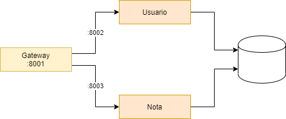

# JavAPIMicros
 Implementación de arquitectura de microservicios simple en Java y Spring

## Servicios 

- GatewayService: Puerto 8001
- UsuarioService: Puerto 8002
- NotaService: Puerto 8003

## Endpoints

### Usuario

#### GET usuario

#### GET usuario/{idUsuario}

#### GET usuario/pagina/{pagina}

#### POST usuario

#### PUT usuario

#### DELETE usuario/{idUsuario}

### Nota

#### GET nota

#### GET  nota/{idNota}

#### GET nota/usuario/{idUsuario}

#### POST nota

#### PUT usuario

#### DELETE nota